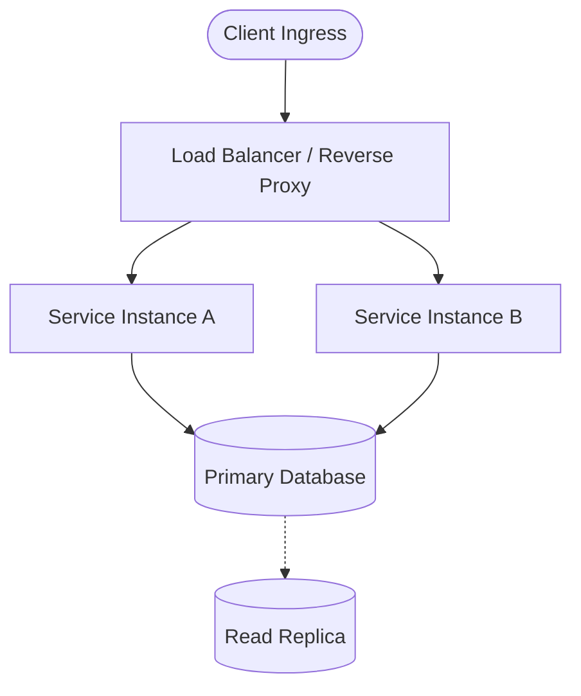

A strong opening paragraph summarizing the context, why this topic matters in real-world systems, and what the reader will learn by the end of this guide.

## Problem Statement & Context

Explain the technical challenge, constraints, or bottleneck that necessitated this architecture or solution.

- **Scale / Volume:** e.g., 50k requests/sec, 10Gbps line rate.
- **Latency / SLA:** e.g., p99 < 15ms.
- **Resilience Goal:** e.g., Zero packet drop during failover.

---

## Architectural Design

Describe the overall topology or high-level system layout.

### Topology Diagram (Mermaid)



### Visual Diagram (Image URL / Local Image)

You can also embed architecture diagrams or screenshots:


---

## Technical Implementation & Configuration

Walk step-by-step through the core configuration or code implementation.

### 1. Configuration File (e.g. NGINX / BGP / Systemd)

```ini
# /etc/example/service.conf
[Global]
WorkerThreads = 8
ListenAddress = 0.0.0.0:8080
KeepAliveTimeout = 65s

[Upstream]
Endpoint = 10.0.1.10:9000
HealthCheckInterval = 5s
```

### 2. Implementation Code

```typescript
export async function handleTrafficRouting(packet: Packet): Promise<RoutingDecision> {
  // Validate headers and routing metadata
  if (!packet.destination || packet.ttl <= 0) {
    throw new Error("Invalid packet destination or TTL expired");
  }

  // Determine optimal path using weighted ECMP
  const nextHop = await calculateNextHop(packet.destination);
  return { nextHop, status: "FORWARDED" };
}
```

---

## Benchmarks & Performance Results

Highlight metrics and performance benchmarks before and after applying the solution.

| Metric | Before Optimization | After Optimization | Improvement |
| :--- | :--- | :--- | :--- |
| **P95 Latency** | 120ms | 18ms | **85% reduction** |
| **Throughput** | 12k req/sec | 68k req/sec | **5.6x increase** |
| **CPU Utilization** | 82% | 34% | **58% lower** |

---

## Key Takeaways & Lessons Learned

Summarize the main lessons, caveats, or trade-offs made:

1. **Trade-off 1:** Memory vs. lookup speed (e.g., in-memory radix tree vs. database query).
2. **Failure Modes:** How the system behaves during network partition or cold cache.
3. **Operational Best Practice:** What telemetry and alerts to configure in production.

---

## References & Further Reading

- [RFC 4271 - A Border Gateway Protocol 4 (BGP-4)](https://datatracker.ietf.org/doc/html/rfc4271)
- [Official Documentation or Whitepaper Link](https://example.com)
