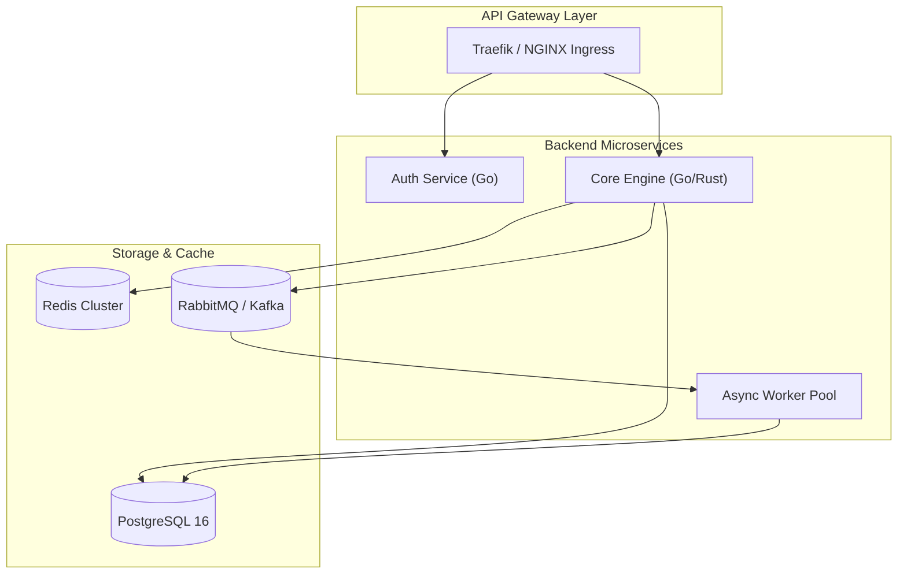

A high-level introduction to the project: what problem it solves, the business or technical motivation, and the core technologies powering it.

## System Architecture

Explain the high-level system topology and how data flows across the components.



---

## Key Technical Achievements

1. **High-Performance Pipeline:** Implemented zero-allocation buffering for maximum network packet ingestion.
2. **Reliable State Management:** Guaranteed at-least-once message delivery with idempotent consumer handlers.
3. **Automated CI/CD & IaC:** Terraform configuration for multi-region provisioning with automated Canary deployments.

---

## Database Schema / Data Flow

```sql
CREATE TABLE IF NOT EXISTS routing_nodes (
    id UUID PRIMARY KEY DEFAULT gen_random_uuid(),
    node_name VARCHAR(128) NOT NULL,
    as_number BIGINT NOT NULL,
    ip_address INET NOT NULL,
    status VARCHAR(32) DEFAULT 'ACTIVE',
    created_at TIMESTAMPTZ DEFAULT NOW()
);
```

---

## Deployment & Production Impact

Describe how this project was deployed, monitored, and the concrete outcomes achieved.

- **Downtime during migration:** 0 minutes (Blue/Green deployment)
- **Infrastructure cost reduction:** 35% reduction in cloud compute bills
- **Monitoring & Observability:** Prometheus metrics & Grafana dashboards with automated PagerDuty alerting.
