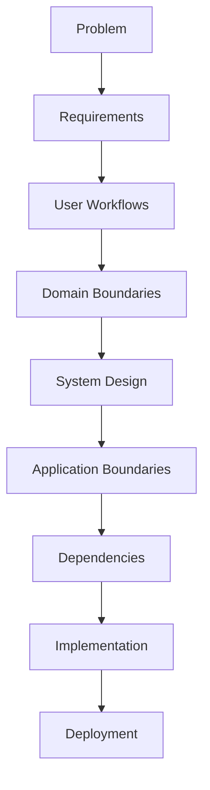
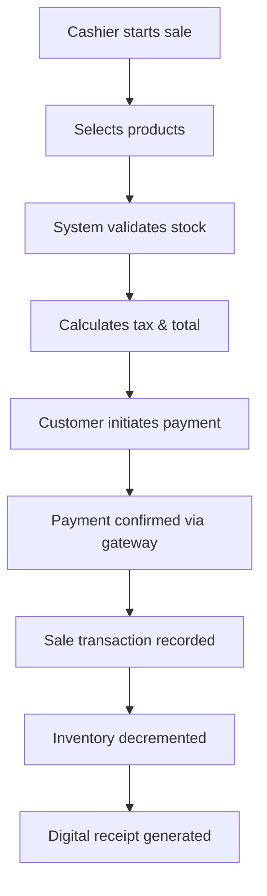
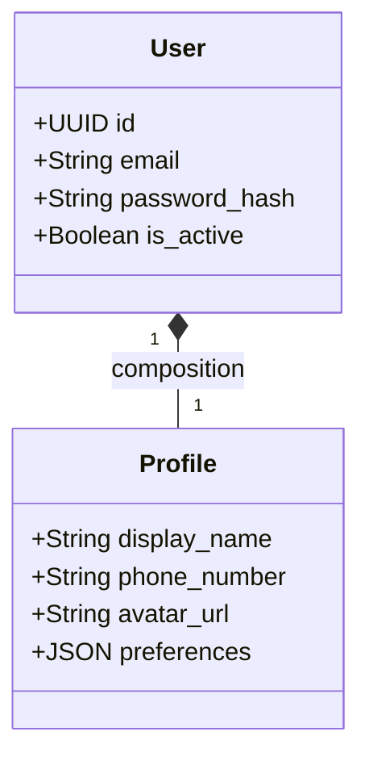
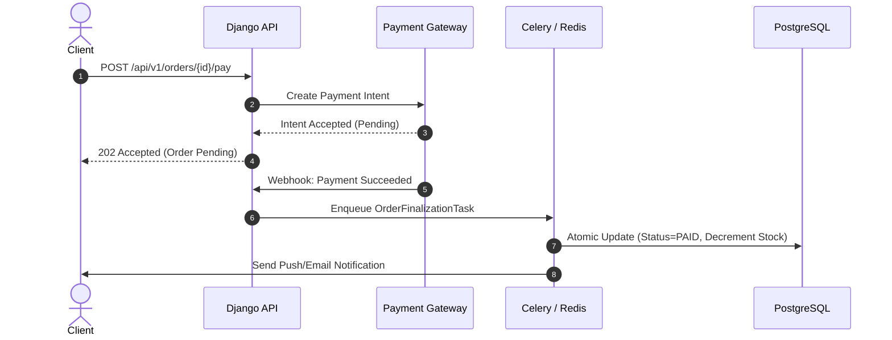
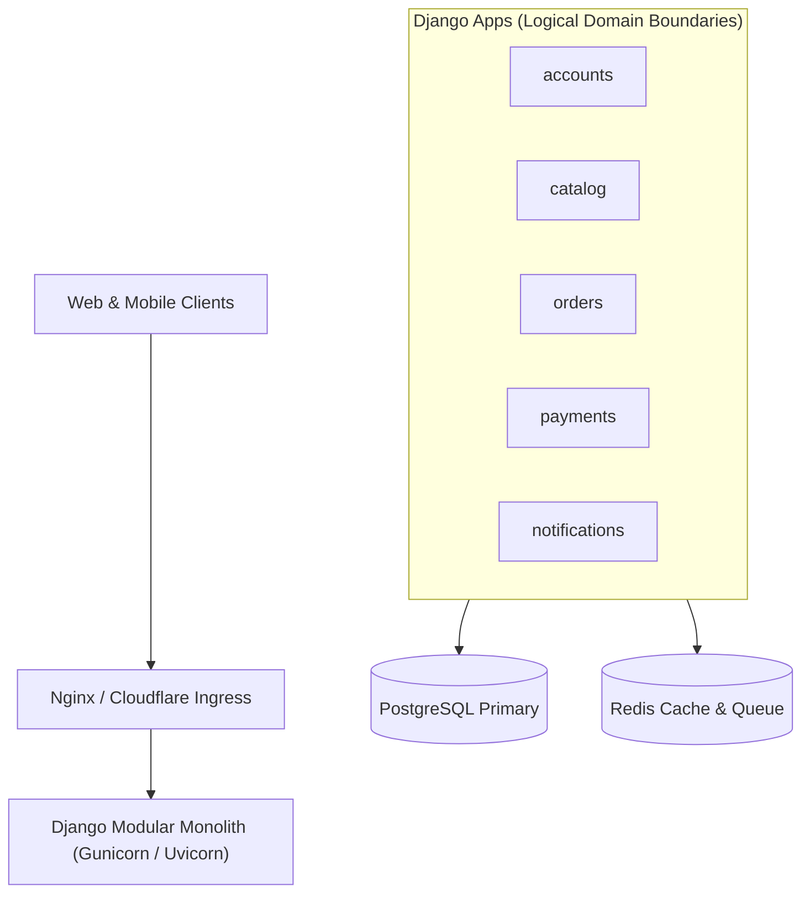
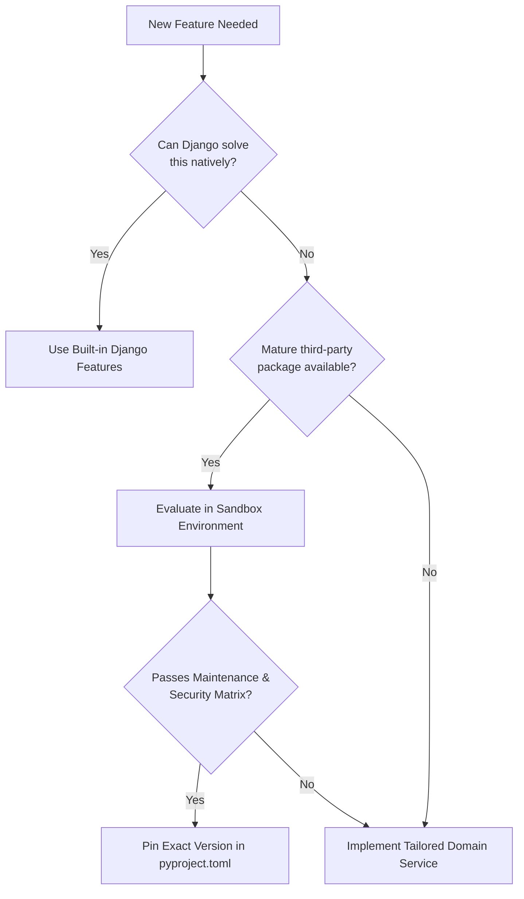
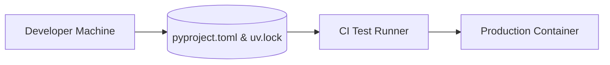
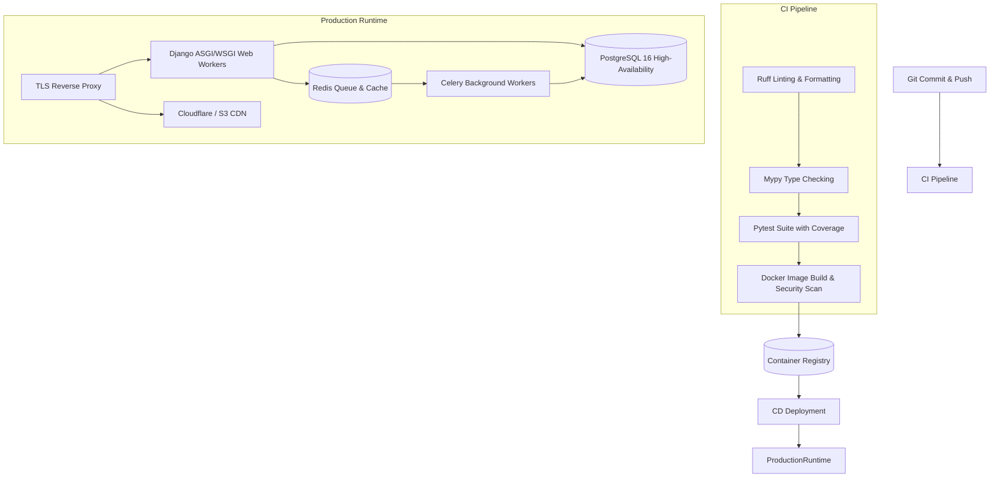

> **A Django project should not begin with `startproject`. It should begin with understanding the problem.**

When starting a new Django application, it is tempting to open a terminal and run:

```bash
django-admin startproject myproject
```

Within seconds, you have a working project. But that command solves only one problem: **creating a Django project structure**.

It does not tell you:
- what the system should actually do,
- who will use it,
- which workflows matter,
- what belongs inside each application,
- which functionality should be built versus reused,
- how the system should evolve,
- or how the architecture should support deployment and operations.

That distinction becomes increasingly important as a Django project grows. A small application can survive weak design decisions. A system expected to serve thousands or millions of users, integrate with external services, run asynchronous workloads, support multiple teams, and evolve for years cannot.

This guide explores the design work that should happen **before and around the first lines of Django code**.

---

## 1. Application Design Is More Than Code Organization

There is a common misconception that application design means deciding where files should live. In Django, developers often reduce design to questions such as:

```text
Should this logic go in models.py?
Should I use a class-based view?
Should I create a service layer?
Should this be a separate app?
```

Those are important questions—but they are **implementation questions**. Application design starts earlier.



The earlier decisions constrain the later ones:
- If the requirements are misunderstood, the domain model will be wrong.
- If the domain boundaries are wrong, the Django apps will be wrong.
- If the apps are wrong, dependencies and APIs will become harder to manage.
- And if the architecture is wrong, no amount of clever Python will completely compensate for it.

> **Architecture is mostly about making good decisions before implementation makes those decisions expensive to change.**

---

## 2. Gather Requirements Before Writing Django Code

Many projects start with a simple feature list:

```text
- Authentication
- Dashboard
- Payments
- Notifications
- Reports
- Admin
```

This looks useful, but it is not enough. A feature list tells you **what someone thinks the system contains**. It does not explain:
- why the feature exists,
- who uses it,
- what business rule it represents,
- what happens before and after it,
- what failure looks like,
- or what the system must guarantee.

### 2.1 Start with the Problem
Instead of asking *"What endpoints do you need?"*, ask:

> *"What problem are we trying to solve?"*

For example:
> *Local merchants lose track of inventory because sales are recorded manually across notebooks, spreadsheets, and messaging applications.*

That statement gives engineering a problem to solve rather than prematurely prescribing an implementation.

### 2.2 Identify the Actors
List the people or systems interacting with the application:

```text
Merchant       → creates products & sets pricing
Cashier        → records sales & manages counter checkout
Store Manager  → reviews revenue reports & audits stock
Administrator  → manages permissions & system configurations
Payment Gateway→ confirms transactions & handles webhooks
Notification   → dispatches SMS/email receipts
```

These actors often become important architectural boundaries later.

### 2.3 Map the Core Workflows
A workflow describes what actually happens end-to-end:



Now we have something that can drive architecture. We can begin asking:
- Is payment synchronous or asynchronous?
- What happens if the payment provider times out?
- What happens if the inventory update fails midway?
- Can the same payment callback arrive twice (idempotency)?
- Which operations require database transactions (`transaction.atomic`)?

---

## 3. Requirements Should Be Written in Human Terms

Avoid unnecessarily technical language when gathering requirements. Talk in terms that application stakeholders understand.

For example, do not ask a non-technical stakeholder:
> *"Should the user entity have a one-to-one relationship with a profile model?"*

Ask:
> *"What additional information should a person have beyond their login credentials?"*



> **Requirements describe behavior. Architecture describes structure. Code describes implementation.** Do not collapse all three into one conversation.

---

## 4. Concepts, Stories, and Shared Mental Models

### 4.1 Write a One-Page Concept Document
Before creating dozens of backlog tickets, write one concise page answering:
1. **Who is the user?**
2. **What problem do they have?**
3. **How do they solve it today?**
4. **What does our system change?**
5. **What is the most critical workflow?**
6. **What does success look like?**

### 4.2 User Stories Come After Understanding
Once the concept is clear, requirements can become user stories:

```text
As a merchant,
I want to register a product,
so that I can include it in point-of-sale operations.

As a cashier,
I want to record a sale with instant barcode lookup,
so that inventory is updated automatically in real time.

As a manager,
I want to view weekly sales aggregated by category,
so that I can optimize replenishment orders.
```

---

## 5. Make Requirements Testable

Senior engineers push requirements toward observable, measurable behavior.

| Vague Requirement | Testable Specification |
| :--- | :--- |
| *"The system should process payments quickly."* | *"A payment initiation must return an accepted HTTP 202 response within 200ms; final settlement confirmation may arrive asynchronously via webhook within 30s."* |
| *"Users should receive notifications."* | *"When an order state transitions from `PAID` to `FULFILLED`, the system must dispatch an asynchronous notification event within 5 seconds."* |



---

## 6. HTML Mockups: Validate the Experience Before the Backend

> **Validate the workflow before investing heavily in backend models and database migrations.**

An interactive prototype lets you discover critical gaps early:
- Missing navigation steps
- Confusing form validations
- Missing empty and error states
- Edge cases in payment workflows

Those problems are trivial to fix in a prototype; they become expensive after APIs, models, permissions, migrations, and frontend integrations already exist.

---

## 7. Avoid Architecture by Fashion

Modern backend engineering offers countless architectural options:

```text
Django Monolith
Django + DRF
Django + HTMX
Django + React / Next.js
Django + Celery + Redis
Django + Channels (WebSockets)
Django + Kafka Event Streams
Django Microservices
```

The existence of a technology does not mean your project requires it. Introducing microservices before understanding domain boundaries distributes the wrong architecture across multiple repositories.

A **modular monolith** is almost always the best starting point:



The important property is not the physical number of services—it is the **quality of the internal boundaries**.

---

## 8. Dividing a Django Project into Cohesive Apps

A Django **project** is the overall configuration and deployment unit. A Django **app** is a Python package responsible for a specific domain capability.

> **A Django app should represent a coherent business capability, not simply a single database table.**

### Poor Decomposition (Table Fragmentation)
```text
users/
products/
names/
addresses/
emails/
phones/
```

### Clean Domain Decomposition
```text
accounts/       → User identity, auth, MFA, and profile management
catalog/        → Product definitions, categories, stock SKU tracking
orders/         → Shopping carts, checkouts, and order lifecycle
payments/       → Payment provider abstractions, invoices, and webhooks
notifications/  → Email, SMS, push delivery with template rendering
analytics/      → Event logging and aggregated reporting queries
```

---

## 9. Cohesion and Loose Coupling

Inside a well-designed app, separate your database models from business logic and query selectors:

```text
orders/
├── models/
│   ├── order.py
│   └── order_item.py
├── services/
│   ├── checkout.py
│   └── cancellation.py
├── selectors/
│   └── order_queries.py
├── api/
│   ├── serializers.py
│   └── views.py
└── tests/
```

### Prefer Explicit Service Boundaries

Instead of letting other apps directly mutate foreign models:

```python
# ❌ Anti-pattern: Deep coupling across app boundaries
order.customer.account.wallet.balance -= order.total
order.customer.account.wallet.save()
```

Use dedicated domain service interfaces:

```python
# ✅ Clean pattern: Domain service handles internal state transitions
payment = payment_service.capture_order_payment(
    order=order,
    idempotency_key=request_id
)
```

---

## 10. Reuse vs. Roll Your Own: The Dependency Matrix

Django has a massive package ecosystem. Before adding any package with `pip install`, run it through a systematic evaluation matrix:

| Evaluation Criteria | Key Questions |
| :--- | :--- |
| **Maintenance** | Is it actively maintained? Does it support current Django & Python versions? |
| **Architecture** | Does it introduce global state or monkey-patch Django internals? |
| **Security** | What is its CVE track record? Does it have unmaintained sub-dependencies? |
| **Operational Footprint** | Does it require Redis, Node.js, Elasticsearch, or native C-bindings? |
| **Reversibility** | If we need to replace or customize it in 18 months, how difficult is the migration? |



---

## 11. Modern Environment & Dependency Strategy

### Python & Django Version Selection (2026 Standards)
- **Python**: Use a supported stable release (**Python 3.14.x**). Avoid using release candidates in production.
- **Django**: Use the latest stable release line (**Django 6.1**), which features native async ORM improvements, modern form rendering, and long support windows.

### Pin Dependencies with Lockfiles
Always use modern tools (`uv`, `poetry`, or `pip-tools`) to maintain deterministic lockfiles:



---

## 12. Project Directory Structure

Here is a modern, production-grade layout for a scalable Django project:

```text
superbook/
├── .github/
│   └── workflows/
│       └── ci.yml
├── config/
│   ├── settings/
│   │   ├── base.py
│   │   ├── development.py
│   │   └── production.py
│   ├── asgi.py
│   ├── wsgi.py
│   └── urls.py
├── apps/
│   ├── accounts/
│   ├── catalog/
│   ├── orders/
│   └── payments/
├── tests/
├── static/
├── templates/
├── Dockerfile
├── docker-compose.yml
├── manage.py
├── pyproject.toml
└── uv.lock
```

---

## 13. Production Deployment & Observability Architecture

Consider operations, telemetry, and CI before deploying the first release:



---

## 14. The Practical Pre-Coding Checklist

Before writing business logic, verify this checklist:

### Product & Domain
- [ ] Problem statement clearly defined in one paragraph
- [ ] Primary actors and roles mapped out
- [ ] Core end-to-end user workflows documented
- [ ] Success criteria and SLAs established

### Architecture & Decomposition
- [ ] Domain boundaries identified before creating apps
- [ ] Modular monolith boundaries chosen over premature microservices
- [ ] Service layer pattern established for cross-app interactions
- [ ] Database transaction boundaries (`atomic`) identified

### Dependencies & Tooling
- [ ] Evaluated dependencies against the maintenance & security matrix
- [ ] Python 3.14 + Django 6.1 environment initialized
- [ ] Deterministic lockfile generated (`uv.lock` / `poetry.lock`)
- [ ] Code formatting (`ruff`), type checking (`mypy`), and test suite (`pytest`) configured

### Operations & Delivery
- [ ] 12-Factor environment variable configuration (`django-environ`)
- [ ] Healthcheck endpoints (`/healthz`, `/readyz`) implemented
- [ ] Structured JSON logging and OpenTelemetry tracing prepared
- [ ] Zero-downtime database migration strategy planned

---

## 15. Summary & Key Takeaways

1. **Requirements Precede Architecture:** Do not turn vague feature wishlists into database tables. Model the real-world workflow first.
2. **Tell the User's Story:** A one-page concept document aligns engineering, product, and stakeholders far better than scattered tickets.
3. **Cohesion Over App Count:** Build apps around business capabilities, keeping loose coupling between them using domain services.
4. **Modularity Without Distributed Complexity:** A well-structured modular monolith provides strong boundaries without microservice operational overhead.
5. **Dependencies Are Commitments:** Every library added to `pyproject.toml` incurs maintenance, upgrade, and security costs. Make them earn their place.
6. **Good Architecture Is Evolutionary:** You do not need to predict the next five years of your application—you only need boundaries that make the next change safe and predictable.

---

## References

- Arun Ravindran, *Django Design Patterns and Best Practices, Second Edition* — Chapter 2: *Application Design*.
- Django Software Foundation, *Django Documentation & Release Notes (Django 6.x)*. [docs.djangoproject.com](https://docs.djangoproject.com)
- Python Software Foundation, *Python 3.14 Release Documentation*. [python.org](https://www.python.org)
- Martin Fowler, *Patterns of Enterprise Application Architecture* & *Modular Monoliths*.