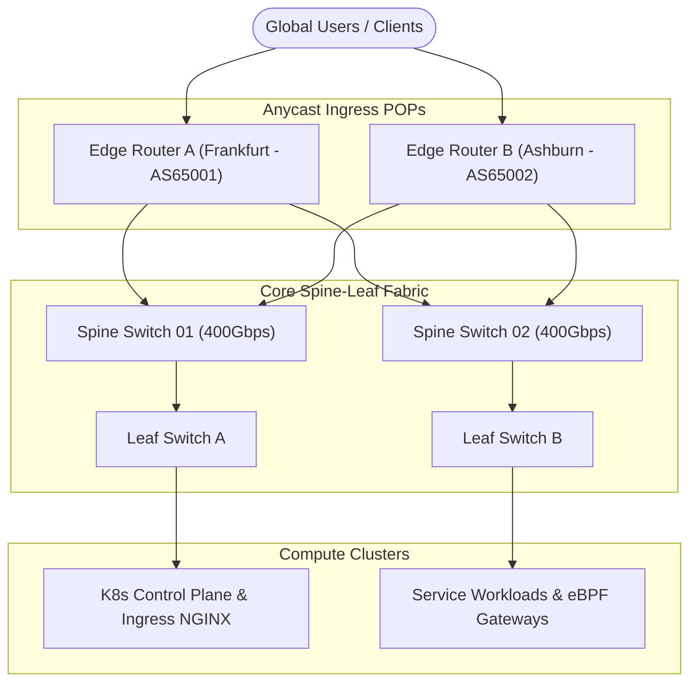
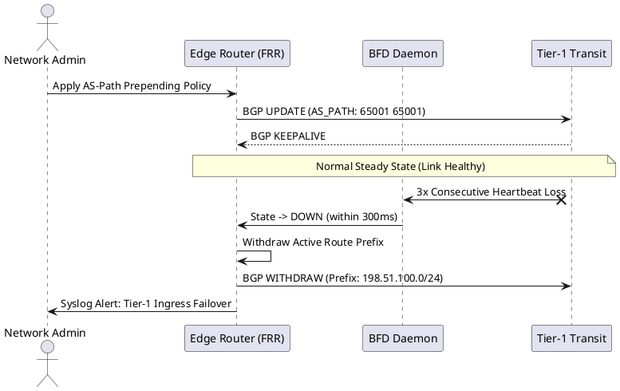

Building a resilient edge network requires deterministic traffic engineering, sub-second failover detection, and transparent anycast load distribution. In this article, we dive into how we designed an enterprise BGP routing topology across multi-region datacenters.

## Network Topology & Edge Ingress

The primary goal is to minimize round-trip times (RTT) for geographically dispersed users while guaranteeing zero-downtime failover during upstream transit outages.



### BFD (Bidirectional Forwarding Detection) Configuration

To achieve sub-300ms failover when a transit link experiences micro-burst drops or fiber cuts, standard BGP keepalive timers (typically 30s/90s) are insufficient. We pair eBGP peers with hardware-offloaded BFD sessions.

```ini
router bgp 65001
  bgp router-id 198.51.100.1
  neighbor 203.0.113.1 remote-as 64496
  neighbor 203.0.113.1 description "Upstream Transit Tier-1"
  neighbor 203.0.113.1 fall-over bfd
  neighbor 203.0.113.1 timers 3 9
  
bfd
  peer 203.0.113.1
    interval 100 min_rx 100 multiplier 3
```

> [!NOTE]
> Setting the BFD multiplier to 3 with an interval of 100ms guarantees link failure detection within 300ms, immediately triggering BGP path convergence and routing withdrawals.

---

## State Transition & Session Lifecycle

The following sequence details how route flapping damping and dynamic BGP session renegotiation operate across upstream Tier-1 providers:



---

## Key Metrics & Results

1. **Sub-second Convergence**: Failover dropped from standard 90s to less than 320ms.
2. **Deterministic Anycast Routing**: 98% of European traffic reliably hits the Frankfurt POP, while North American traffic routes directly through Ashburn.
3. **Zero Packet Loss during Maintenance**: BGP community-based maintenance drain routes before maintenance windows.
