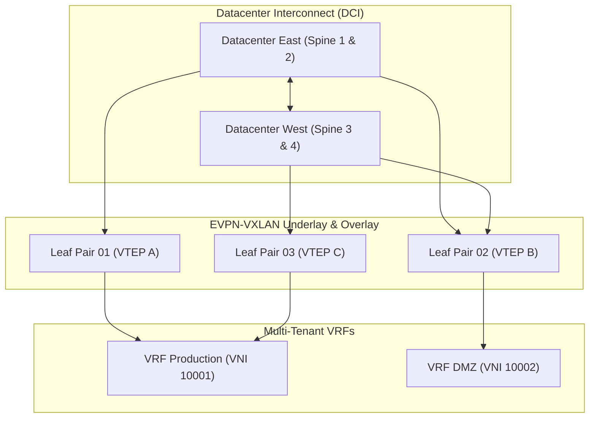

This project involved designing and migrating a mission-critical multi-tenant datacenter network from legacy STP (Spanning Tree Protocol) to a modern, scalable **EVPN-VXLAN Spine-Leaf architecture** using BGP as the control plane.

## High-Level Architecture Overview

### Key Technical Achievements

1. **Elimination of STP Blocking**: Full bisectional bandwidth utilization across all links using Equal-Cost Multi-Path (ECMP) routing.
2. **Layer 2 Extension over Layer 3**: Seamless VM mobility across physical racks without re-IPing.
3. **Automated Provisioning**: Infrastructure-as-Code via Ansible to deploy consistent switch configurations across all leaf pairs.
